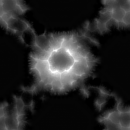
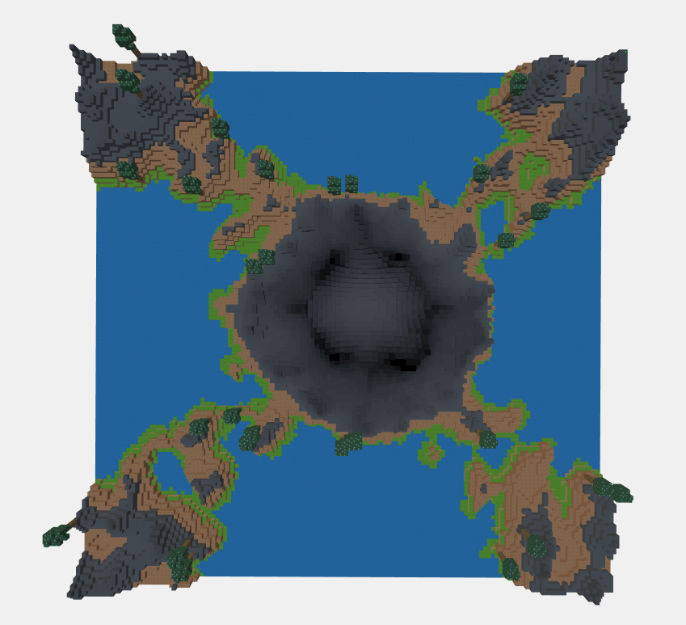
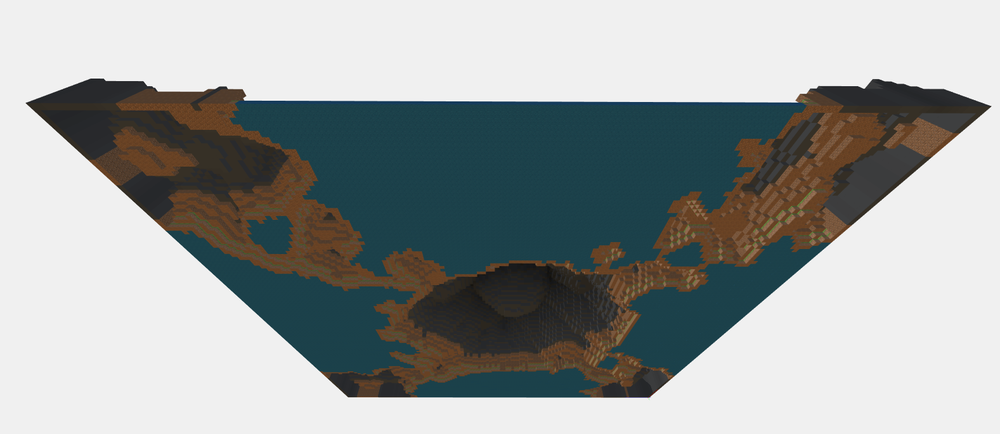
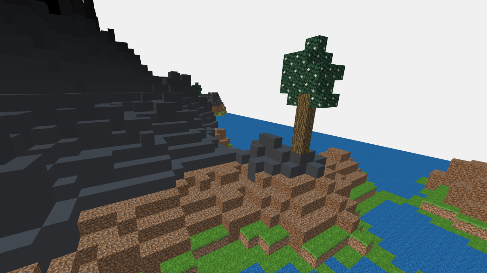
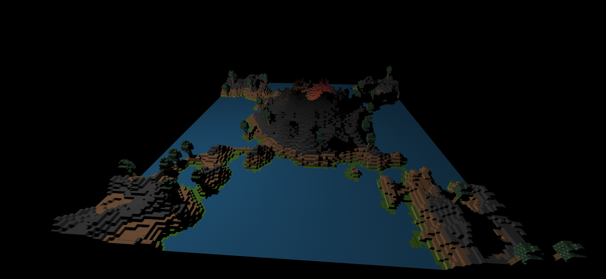
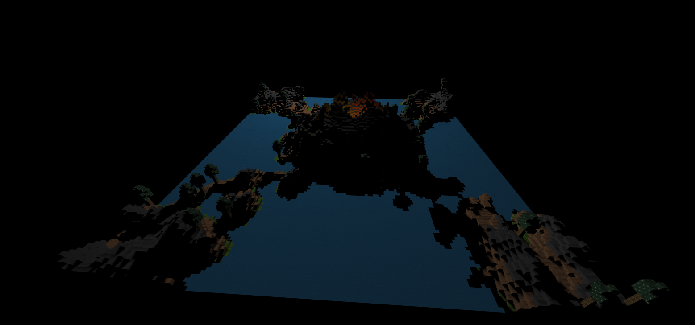

# Interactive 3D Graphics Project 

Corso anno accademico 2019-2020

## **Niccolò Carlo Bellucco**
Matricola: **145799**

# Heightmap Volcano

Il progetto consiste nella realizzazione di un terreno costituito da cubi di uguale dimensione su più livelli.
La mappa è stata generata a partire dai dati presi da un'immagine a piacere in bianco e nero, utilizzata come heightmap.

La scelta è ricaduta sulla mappa di profondità di un'area contenente un vulcano, in modo da avere più livelli di altezza da poter analizzare e diverse variazioni irregolari, così da poter capire come gestire anche le eccezioni che altrimenti non sarebbero state visibili in una pianta più regolare.

È stata utilizzata un'ottimizzazione nella creazione dei cubi, per evitare di aggiungere elementi alla scena che non sarebbero risultati visibili o utili in alcun modo nella visualizzazione (così da mantenere il framerate accettabile almeno fino all'aggiunta delle luci e delle ombre in movimento).

Come si può vedere, infatti, viene disegnato solo il "guscio" del terreno visualizzato: non vi sono parti piene dove i cubi non hanno bisogno di essere disegnati.

## Textures

Successivamente alla creazione dei cubi, sono state assegnate le texture in base ai livelli di altezza dei singoli cubi, in modo da creare un paesaggio verosimile (le parti piatte sono costituite da acqua, i primi rilievi di terra e il vulcano è costituito da pietra con colore che si scurisce verso la cima).

Tutti i file delle texture e della heightmap sono presenti nella cartella "textures".

## Alberi

Sono stati aggiunti i modelli degli alberi, questi realizzati invece con three.js editor e importati successivamente nella scena. Il modello è unico e viene clonato più volte per il numero di alberi da posizionare, scelto a priori (nella cartella "models", l'oggetto "tree.json").

A causa di problemi con l'esportazione delle texture assegnate nell'editor, le stesse sono state riassegnate direttamente nel programma (sapendo che i primi 5 cubi nell'oggetto sono quelli facenti parte del tronco, è bastato assegnare i materiali ai singoli cubi in ordine).

Le posizioni degli alberi sono generate casualmente ad ogni esecuzione del programma (a volte serve ricaricare la pagina nel caso il modello non venga caricato in un primo momento), ma vengono comunque sottoposte a dei costraints per non essere posizionate nei cubi d'acqua o troppo in alto lungo il vulcano.

## Luci

La luce principale utilizzata è una PointLight che gira attorno al modello e genera le ombre per creare un effetto di luce solare. Le due luci secondarie sono posizionate all'interno del catere del vulcano per creare l'effetto del magma, queste ultime non generano ombre poichè sarebbero presenti problemi di contrasto con le ombre della luce principale.

Non tutti i cubi ricevono le ombre delle luci, infatti quelli acquatici e all'interno del cratere non vengono mai coperti (questi ultimi per evidenziare le luci del magma che sarebbero altrimenti state poco visibili).

