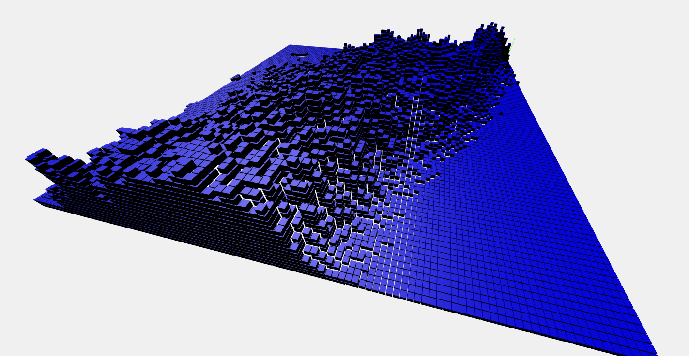
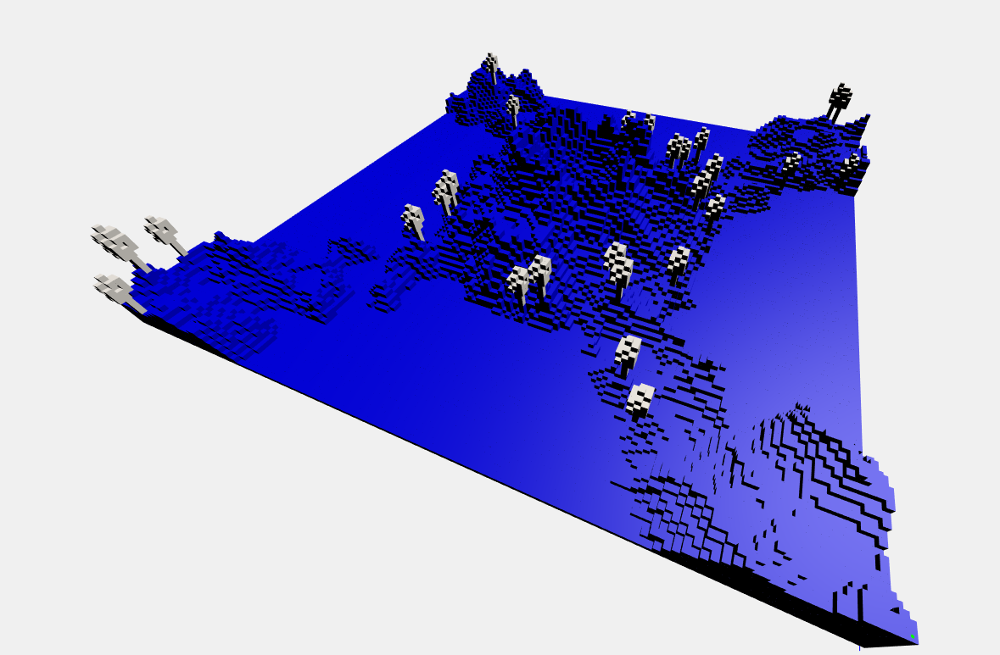

# Interactive 3D Graphics Project 

Corso anno accademico 2019-2020

Niccolò Carlo Bellucco

Matricola: 145799

# Journal

## 1. Generazione heightmap e ottimizzazione cubi

Il primo passo è stato quello di generare un algoritmo efficiente per la lettura della heightmap passata al programma, con la successiva generazione di un terreno 3d costituito da cubi di uguale dimensione.

La funzione di lettura dei dati dell'immagine è quella fornita dall'esercizio, che legge i valori di intensità di bianco e nero della heightmap e li immagazzina in un array. L'array viene poi utilizzato durante la costruzione di una matrice di dimensione proporzionale al numero di informazioni salvate (ovvero la dimensione in pixel e la risoluzione dell'immagine).

La matrice viene utilizzata per istanziare i cubi del terreno e generare una mappa 3d renderizzata a schermo che ricostruisce la heightmap in 3 dimensioni basandosi sui valori di intensità dei pixel.

La funzione di caricamento dell'immagine e di lettura dei dati, poichè potrebbe richiedere del tempo non sempre immediato, utilizza un flag per comunicare al renderer quando i calcoli sono finiti e le informazioni necessarie salvate, così da poter iniziare a crare la scena solo nel momento più opportuno senza errori.

Inizialmente la mappa è stata generata con parallelepipedi di altezza pari al valore presente in ogni pixel. Pensando poi all'applicazione delle texture di dimensione quadrata (e quindi adatte ad un cubo), si è deciso di utilizzare dei cubi di dimensione unitaria (nelle immagini ridotto per visualizzare la corretta creazione della griglia). In questo modo però è necessario aggiungere, per ogni posizione, un numero di cubi pari al valore di altezza massima della posizione / il lato del cubo selezionato.

L'utilizzo dei cubi però ha portato ad primo problema, cioè l'aumento massiccio del numero di mesh da istanziare e visualizzare a schermo con evidente perdita di framerate. La soluzione è stata trovata tramite alcuni accorgimenti per diminuire il numero di cubi da utilizzare:
- Non tutte le posizioni della griglia necessitano di cubi sottostanti, poichè essi non vengono visti a schermo
- Solo i bordi della mappa devono essere completamente coperti per dare l'impressione di un "solido pieno" e del terreno come un elemento unico
- Sono necessari dei cubi aggiuntivi nei casi in cui, per ogni cubo interno, quelli adiacenti abbiano una differenza di altezza maggiore dell'altezza di un cubo (quindi nel caso in cui rimangano dei "buchi" in altezza dove ci sono particolari dislivelli). In quest'ultimo caso basta aggiungere un numero di cubi pari alla differenza in altezza maggiore rispetto ai cubi adiacenti / lato di un cubo.

## 2. Generazione casuale alberi

Una volta appurato che il terreno fosse generato correttamente, è stato deciso di posizionare sulla mappa un numero finito di alberi, generati in posizioni casuali, per rendere la scena più ricca.

Il primo passo è stato quello di creare il modello di un albero con il three.js editor, in modo da poter avere un solo elemento contenente raggruppante tutti i cubi e non doverne istanziare di nuovi direttamente nel programma.

Una volta creato il modello, è stato importato e anche in questo caso la funzione di caricamento del modello imposta un flag per comunicare al programma se il caricamento è andato a buon fine (per evitare errori di clonazione del modello nel caso non sia ancora disponbile).

Le posizioni sono generate casualmente all'interno del terreno tenendo conto delle dimensioni X e Z della matrice, ma vi sono delle restrizioni utilizzate per rendere il posizionamento più realistico:
- Un albero non può essere posizionato in un cubo ad altezza = 0, poichè questi nella maggior parte costituiscono cubi acquatici
- Un albero non può essere posizionato troppo in alto lungo i versanti del vulcano

Dato che al variare della mappa cambieranno le posizioni dove un albero non può essere posizionato, e scrivere le condizioni scegliendo delle precise aree di celle sarebbe controproduttivo, servirà un ciclo while che genera coordinate di posizionamento finchè non ne trova abbastanza adatte per il numero selezionato di alberi.

Non viene controllato che gli alberi non vengano posizionati più volte sulla stessa casella, ma dato il numero molto elevato di posizioni possibili (almeno nelle mappe utilizzate come prova) non ha mai dato problemi a riguardo. In caso basterà cambiare le condizioni ed effettuare dei controlli, o ridurre il numero di alberi da generare.

Ogni albero è un clone del modello caricato dal programma.

